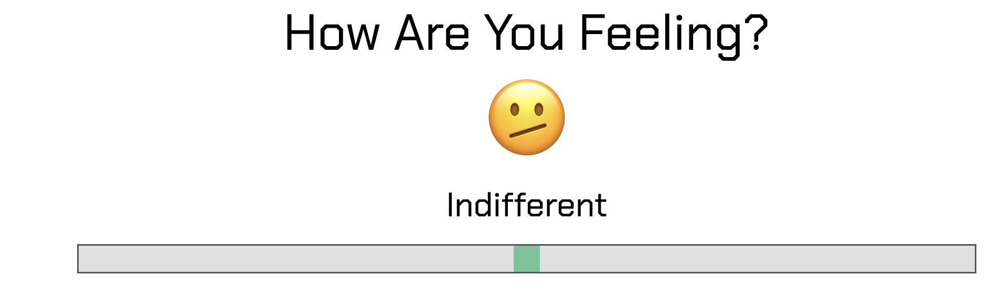
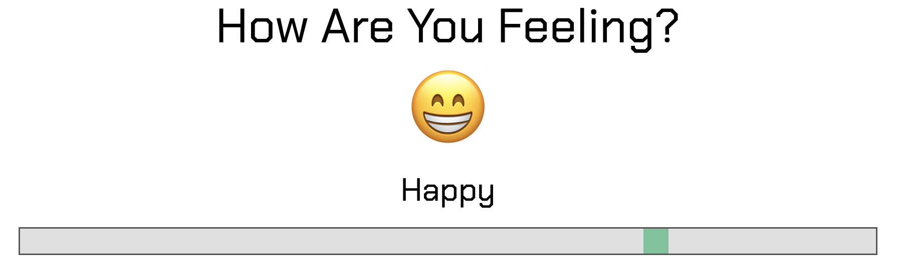
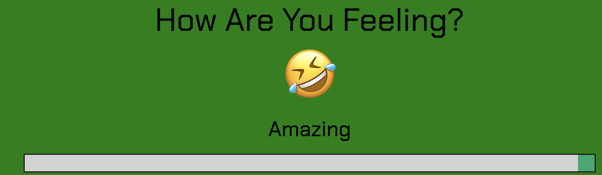
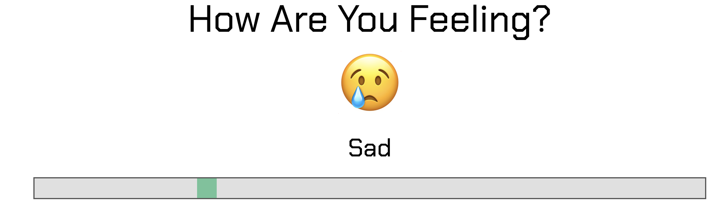
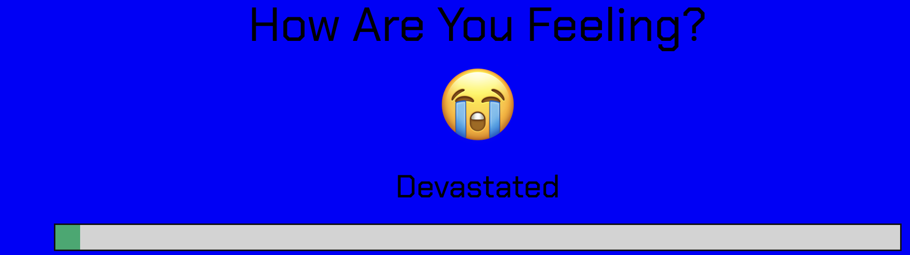

# Slider Widget

## Overview
- The slider widget provides a user-friendly interface element for adjusting values within a predefined range by sliding a handle along a track. User is asked how they are feeling and user can choose from **Devastated** to **Amazing** with its respective background color and emoji. Additionally, choosing **Amazing** results in money emojis falling from the top of the screen to the bottom

## Audience and User Stories

- N/A

## Features and Usage

- **Select** and **Hold** the Range slider handle and **Move** left to right

### Indifferent (Initial State)

 
 
```
  emojiDisplay.textContent = '🫤'; // Neutral Face
          feelingTxt.textContent = 'Indifferent'; 
          changeBackgroundColor('white');
          break;
```

### Happy (Move Slider Right Once)



```
 emojiDisplay.textContent = '😁'; // Smiling Face with Teeth
          feelingTxt.textContent = 'Happy'; 
          changeBackgroundColor('white');
          break;
```

### Amazing (Move Slider Right Twice)



```
emojiDisplay.textContent = '🤣'; // Crying Laughing Face
          feelingTxt.textContent = 'Amazing'; 
          startDollarRain();
          changeBackgroundColor('green');
          break;
```

### Sad (Move Slider Left Once)



```
 emojiDisplay.textContent = '😢'; // Face with Sad Tear
          feelingTxt.textContent = 'Sad'; 
          changeBackgroundColor('white');
          break;
```

### Devastated (Move Slider Left Twice)



```
 emojiDisplay.textContent = '😭'; // Crying Emoji
          feelingTxt.textContent = 'Devastated';
          changeBackgroundColor('blue');
          break;
```
                                                  
## Wireframes and Diagrams

- A rough Diagram of what our widget looks like
  
- 

- Screen 3 Shows a wirefram for our widget

- 

## Installation
- Use [this link](https://html-preview.github.io/?url=https://github.com/cse110-sp24-group18/warmup-exercise/blob/slider-full-implementation/slider/slider-widget.html) to run program.

## Design Insights and Philosphy

## Accessibility

- Straightforward use of slider handle to select current mood

## Application Overview

## Testing and Troubleshooting
- No Major Programming issues, simple quality of life adjustments such as smoothness and improvements in visual design.

## Live Demo

-  Use [this Link](https://youtu.be/HsndNf12wpM) to view the Live Demo

## Limitations

- Simplicity of program does not allow diverse changes

## Aknowledgements

- Ryan Seidl, Aritra Dutta, Elijah Hosaka, Sam Hormozian

 
